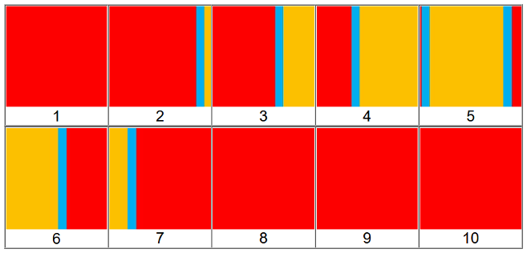
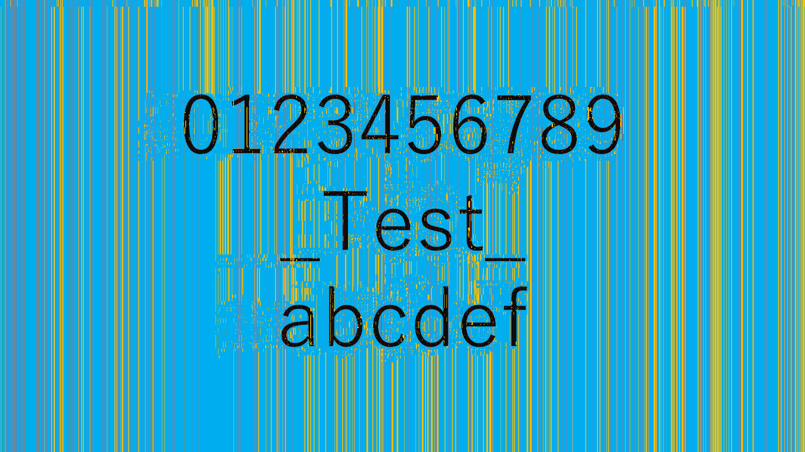
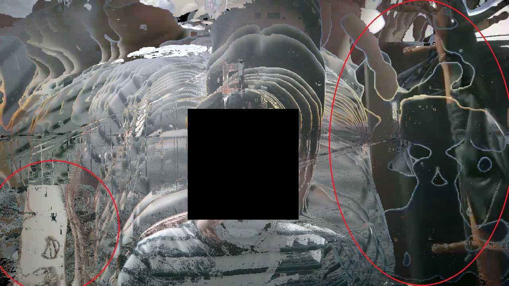
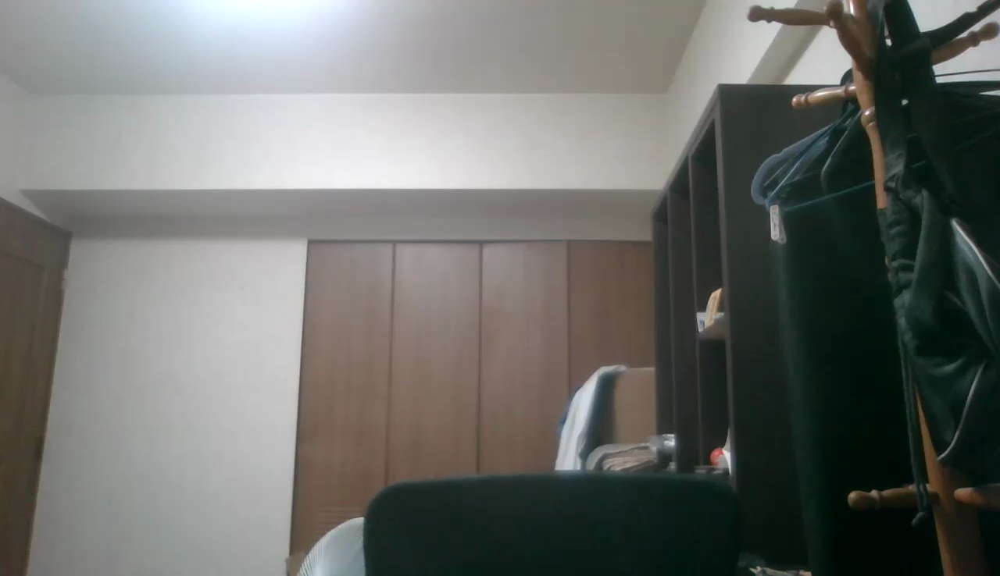

<!-- @format -->

    

# **zoomg**

バーチャル背景適用済み動画から部屋の画像を復元するライブラリ

  

**zoomg PyPI パッケージの仕様は[こちら](./zoomg_docs.md)**

## 手法

はじめに理想的な動画を用いての説明を行い，その後に実際の動画に適用する．理想的な動画とはバーチャル背景が赤色，オブジェクトが黄色，部屋が水色である動画とする．ここではオブジェクトが右から左へ横切ることを想定している．※フレーム数確保のため速度を落としている．

基本的な考え方としては，バーチャル背景が部屋を即座に隠すことを利用し，各ピクセルごとに出現時間が短い色を選ぶことで部屋を復元する．以下の画像は理想的な動画の同一部分を拡大し並べたものである．  
  
バーチャル背景とオブジェクトの色には部屋の色よりも幅があり長時間表示されているため，出現頻度が高くなりやすい．よって，最も出現頻度が低い水色が，部屋の色だと決定できる．実際にはピクセルごとに処理を行うため，ある程度のフレーム数が必要である．以下の画像は理想的な動画の座標 500，500 の色を時間軸を横にとり，並べたものである．  
  
水色が最も少ないことがわかる．フレーム数と動画長が増加するほど復元の精度が向上する．問題はバーチャル背景と部屋の色が境界で混ざり合う場合である．これはバーチャル背景と部屋の色差を利用して，排除している．バーチャル背景は先に説明した部屋の復元の逆，最も出現頻度が高い色を選択することで取得できる．今後，色差計算が精度向上に大きく影響する可能性がある．

### 理想的な動画

理想的な動画および，部屋部分を写真に変更した理想的な動画に zoomg を適用する．復元された画像は以下になる．

**理想的な動画**  
部屋部分  
  
500,500 の時間変化  

**部屋部分を写真に変更した理想的な動画**  
部屋部分  
  
500,500 の時間変化  
  
共にパラメータを 20 とした．フレーム数の関係でバーチャル背景のみとなったピクセルは縦の線として現れている．オブジェクトと同色のクラスタはパラメータ調整により削減できる．パラメータを 5 とした sample_02 の部屋部分を以下に示す．

### 実際の動画

実際の zoom から得られた動画に zoomg を適用する．復元された画像は以下になる．

**復元された画像**  
部屋部分(顔黒塗り)  
  
500,500 の時間変化  
  
パラメータを 90 とした．フレーム数の関係で腕などの表示時間が短いため，背景と判定されている．大幅にバーチャル背景が乱れる現象も復元には大きく影響している．実際の部屋と比べると，赤く囲った部分が復元できていることがわかる．

**実際の部屋**  

## 対抗手法

グリーンバックを使えば部屋の情報が漏れる心配はない．技術的な対策としては，バーチャル背景を不規則に動かすことが挙げられる．規則的に動く場合，バーチャル背景のピクセルが累積してしまうので動画時間によっては復元される恐れがある．バーチャル背景の画像を十分長さのある動画とし，色と場所をランダムにしたノイズピクセルをばらまくことで機械的な復元を妨げることができる．

### フレーム単位のノイズ

理想的な動画をフレーム単位で分割し，1 つのフレームのバーチャル背景部分をノイズに変更したものを再度動画にしたものに zoomg を適用する．  
  
フレーム単位で挿入するため，オブジェクトが動いた後の動画後半に挿入した．これは得られた部屋の情報がノイズによってかき消されることを意味している．復元された画像は以下になる．

**復元された画像**  
部屋部分  
  
500,500 の時間変化  
  
1000,1000 の時間変化  
  
パラメータを 20 とした．ノイズによって復元が妨げられていることがわかる．

### ピクセル単位のノイズ

フレーム単位のノイズでは，フレームを削除することにより容易に復元が可能となる．これを防ぐため，バーチャル背景のランダムな箇所へピクセル単位でのノイズを挿入する．ノイズのピクセルサイズをもランダムにすることで予測を困難にすることができるが，動画の質が低下してしまう．本対策ではバーチャル背景の認識に影響を与えない程度のノイズを目指し，ノイズの座標と量をランダムに散りばめることとした．ノイズを含ませたバーチャル背景用動画を zoom のバーチャル背景として使用した動画に zoomg を適用する．動画は[zoom_vbg.png](images/algorithm/zoom_vbg.png)より生成したもので，読み込みの関係で mov への変換を行った．

**復元された画像**  
部屋部分(顔黒塗り)  
  
  
500,500 の時間変化  
  
上の画像をパラメータ 60，下の画像をパラメータを 90 とした．ノイズにより部屋の復元がさらに困難になっていることがわかる．

## 発表履歴

### AVTOKYO2020 (2020/10/31)

[**ビデオチャットの映像から部屋が盗み見られる！？ バーチャル背景適用済み映像から部屋の画像を復元する手法とその自動化**](https://www.avtokyo.org/2020/event#h.63406795e53f30c_38)

[発表資料](https://github.com/Tsuku43/zoomg/tree/master/avtokyo)

> 近頃、COVID-19 の影響によりビデオチャットを行う機会が増えている。部屋を隠すために使われるバーチャル背景は、部屋の掃除を不要とするだけでなく私生活を晒すリスクを抑えている。しかし、一般的なビデオチャットツールのバーチャル背景の不安定さにより、その映像から部屋の画像を復元可能であることを発見した。さらに単純なアルゴリズムを用いることで、その自動化に成功した。これら復元の考え方と自動化手法及びその結果を発表するとともに、手法に対する対抗策を紹介する。

### 情報通信システムセキュリティ研究会 (2021/03/01)

**仮想背景を使用したリモート会議映像における秘匿された背景の再構築手法**

[論文リンク](https://www.ieice.org/ken/paper/20210301ZCDg/)

> リモートでの業務が推奨される現在，ビデオチャットソフトウェアを用いた対人コミュニケーションが必須となってきている．自宅などの個人の生活と密接に関わる場所では，ソフトウェアに搭載されている仮想背景機能を使用することがプライバシー保護の観点から重要と考えられている．本研究では，仮想背景と残すべき人物映像の境界に発生する不安定さを用いて，秘匿されるべき屋内の背景情報を再構築する手法を提案し，実際の映像に適用する．現状で広く一般に使用されているビデオチャットソフトウェアを用いて仮想背景を用いたプライバシー保護の効果を評価することで，新たなプライバシー保護手法の必要性を示す．

## Authors

- **[satoki](https://github.com/satoki)**
- **[xryuseix](https://github.com/xryuseix)**
